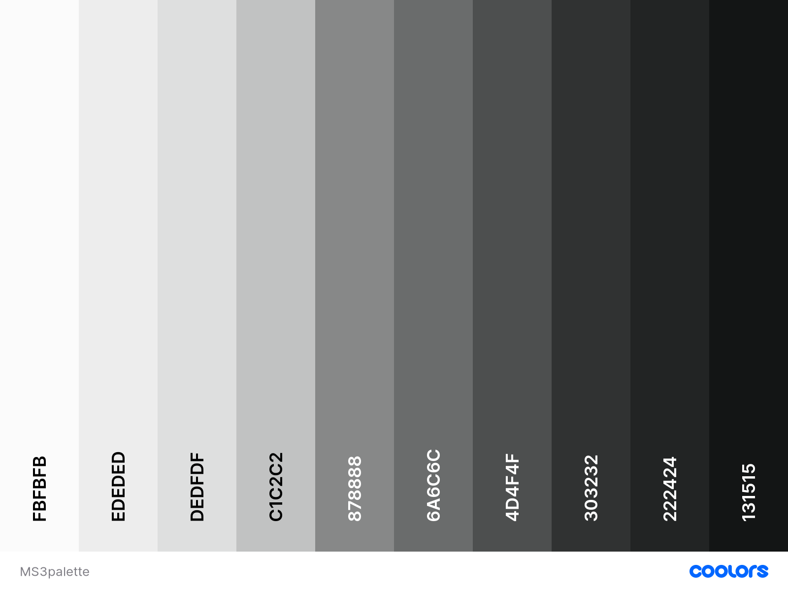

# Contents
* [UX](#UX)
    * [Strategy](#Strategy)
       * [Project Goals](#Project-Goals)
       * [User Stories](#User-Stories) 
    * [Structure](#Structure)
       * [Existing Features](#Existing-Features) 
            
       * [Features Left To Implement](Feature-Left-To-Implement)  
       * [Design](#Design)
            * [Colors](#Colors)
            * [Typography](#Imagery)
            * [Imagery](#Imagery)    
    * [Skeleton](#Skeleton)
      * [Wireframes](#Wireframes)
    * [Technolgies Used](#Technologies-Used)
    * [Testing](#Testing)
    * [Deployment](#Deployment)
      * [Deployment Steps](#Deployment-Steps) 
      * [Making a clone to run locally](#Making-a-clone-to-run-locally)
      * [How to Fork the respository](#How-to-Fork-the-Respository)
    * [Credits](#Credits)
      * [Media](#Media)
      * [Code](#Code)
      * [Acknowledgements](#Acknowledgements)

# UX

## Strategy

### Project Goals

**The Ideal User of this site is:**
  

### User Stories

* As a first time user I want to be able to easily access information about local Irish history.
* As a first time user I want the site UX to be intuitive for ease of use. 
* As a returning user I want to be able to create my own profile.
* As a returning user I want to be able to add local history of my own to the site.
* As a returning user I want to be able to edit/delete any contribution I have made to the site. 

# Structure

## Existing Features

## Features left to implement

## Design

### Colors

 

This palette was found on the [Coolors Website](https://coolors.co).

### Typography

### Imagery

## Skeleton

### Wireframes

## Technologies Used
- This project is primarily built using HTML5 semantic markup, CSS stylesheets and Javascript.
- [jQuery](https://jquery.com/)
    - This framework was used to create some of the site's interactive functions.
- [Gitpod](https://gitpod.io)
    - This project was built using Gitpod as the IDE.
- [Google fonts](https://fonts.google.com/) 
    - The font styles used on this website were chosen from Google fonts.
- [Bootstrap 4.5](https://getbootstrap.com/)
   - Various aspects of this website were structured using Bootstrap.
   - Bootstrap was used to make this website responsive
- [Fontawesome](https://fontawesome.com/)
    - The icons used on this page were found in Fontawesome.
- [Hover.css](https://ianlunn.github.io/Hover/) 
    - The hover feature of the buttons of the site were implemented using Hover.css. 
- [Popper.js](https://popper.js.org/)
    - Certain bootstrap responsive elements require Popper.js in order to function correctly.
- [Balsamiq](https://balsamiq.com/)
    - The wireframes for this project were created using Balsamiq.
- [FreePik](https://www.freepik.com/)
    - All of the vectors used in this project were found on Freepik. 
- [Freeformatter- CSS beautifier](https://www.freeformatter.com/css-beautifier.html)
    - This was used to format the CSS stylesheet.
- [Freeformatter- HTML formatter](https://www.freeformatter.com/html-formatter.html)
    - This was used to format each HTML page
- [Google DevTools](https://developers.google.com/web/tools/chrome-devtools) 
    - Google Dev Tools was extensively used throughout the project for various styling and testing purposes. Its lighthouse feature was used as one of the main testing tools for this project.
- [Animate.css](https://animate.style/)
    - Buttons, images and popups were animated using Animate.css.
- [SweetAlert2](https://sweetalert2.github.io/)
    - All pop-ups were created using SweetAlert2.
- [EmailJS](https://www.emailjs.com/)
    - The contact-form was created using EmailJS following a code institute tutorial.
- [CSS-Tricks](https://css-tricks.com/)
    - This was used as a general reference resource.
- [Favicon.io](https://favicon.io/) 
    - This was used to create the site's favicon.
- [Am I Responsive](http://ami.responsivedesign.is/)
    - This was used to test the responsiveness of the site and also to create the mock-up image presented at the start of this document.
- [Beautifier.io](https://beautifier.io/)
    - Beautifier.io was used to format all javascript files in this project.

## Testing
Testing information can be found here in the separate [TESTING.md file](TESTING.md)

## Deployment
This project was developed using [Gitpod IDE](https://gitpod.io) and pushed to Github using the in-built terminal.

This project was deployed from the [Github Respository](https://github.com/AideenM12/Childs-Play-English-MS2) to GitHub Pages using the following steps:

### Deployment Steps

1. Log into Github.
2. Select the [AideenM12/Childs-Play-English-MS2](https://github.com/AideenM12/Childs-Play-English-MS2) respository.
3. Click the settings tab.
4. Scroll to the GitHub Pages section of the page.
5. Under the source heading select the *master* branch option.
6. Click save.
7. The project has now been deployed. Scroll back to the GitHub pages section and click on the link above the source heading to view the live site.

### Making a clone to run locally

1. Log into GitHub.
2. Select the [respository](https://github.com/AideenM12/Childs-Play-English-MS2).
3. Click the Code dropdown button next to the green Gitpod button.
4. Download ZIP file and unpackage locally and open with IDE. Alternatively copy the URL in the HTTPS box.
5. Open the alternative editor and terminal window.
6. Type 'git clone' and paste the copied URL.
7. Press Enter. A local clone will be created.

### How to Fork the respository.

1. Log into GitHub.
2. In Github go to (https://github.com/AideenM12/Childs-Play-English-MS2).
3. In the top right hand corner click "Fork".

## Credits

### Media

### Code

### Acknowledgements

