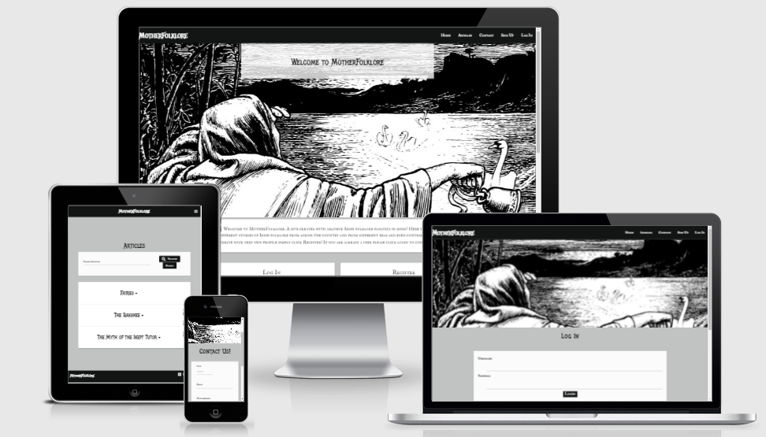
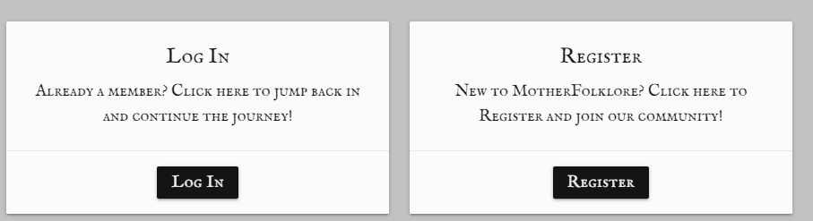
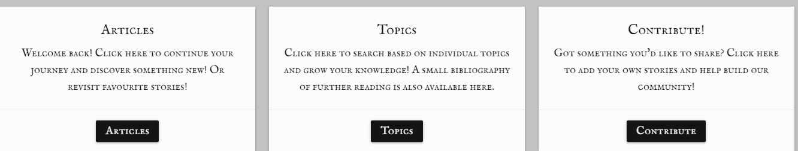
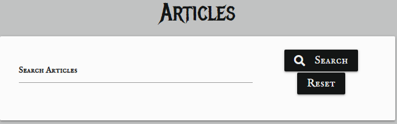
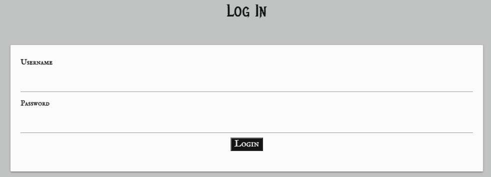
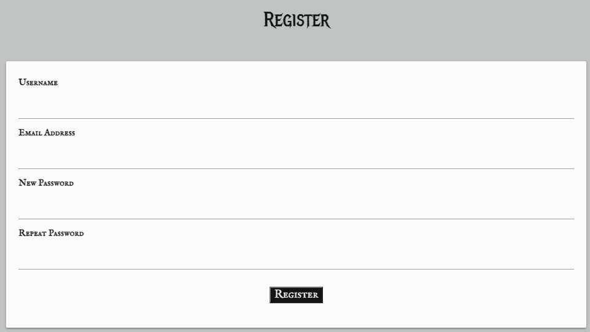
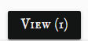
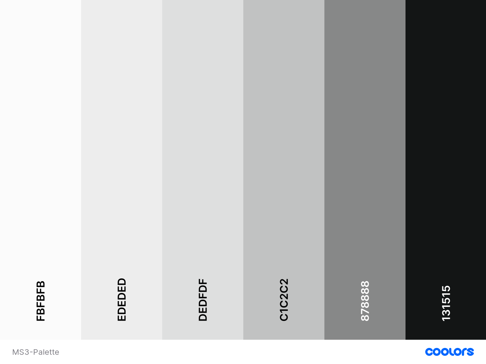
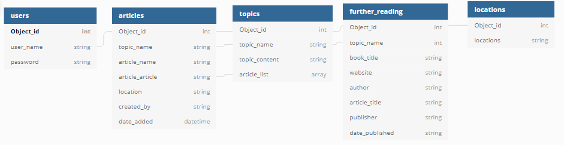

# Contents
* [UX](#UX)
    * [Strategy](#Strategy)
       * [Project Goals](#Project-Goals)
       * [User Stories](#User-Stories) 
    * [Structure](#Structure)
       * [Existing Features](#Existing-Features) 
            
       * [Features Left To Implement](Feature-Left-To-Implement)  
       * [Design](#Design)
            * [Colors](#Colors)
            * [Typography](#Imagery)
            * [Imagery](#Imagery)    
    * [Skeleton](#Skeleton)
      * [Wireframes](#Wireframes)
      * [Database Schema](#Database-Schema)
      * [Sitemap](#Sitemap)
    * [Technolgies Used](#Technologies-Used)
    * [Testing](#Testing)
    * [Deployment](#Deployment)
      * [Deployment Steps](#Deployment-Steps) 
      * [Making a clone to run locally](#Making-a-clone-to-run-locally)
      * [How to Fork the respository](#How-to-Fork-the-Respository)
    * [Credits](#Credits)
      * [Media](#Media)
      * [Code](#Code)
      * [Acknowledgements](#Acknowledgements)

# MotherFolklore

The live website can be viewed [here](https://motherfolklore.herokuapp.com/)

# UX

## Strategy

### Project Goals
The primary goal of this site is to facillate Irish History lovers to be able to read and share local history from their regions. It was inspired by the [Three Castles Burning Podcast](https://threecastlesburning.libsyn.com/) which deals with lesser known tales and folklore from the capital. The primary goal of the site is to allow site users to share lesser known stories from the rest of the country and perhaps debunk some well kept myths too.

**The Ideal User of this site is:**
* English speaking.
* Has a passion for history. 
* Interested in local lore.
* Has a curiousity about their provincial area.
* Wants to learn more about Irish History. 
  

### User Stories

* As a first time user I want to know the main purpose of the site immediately upon arriving on the site.
* As a first time user I want to be able to easily access information about local Irish history.
* As a first time user I want the site UX to be intuitive for ease of use. 
* As a returning user I want to be able to register with the site and create my own profile which I can log in to at any time.
* As a returning user I want to be able to add local history of my own to the site.
* As a returning user I want to be able to edit/delete any contribution I have made to the site. 
* As a user I want the site be responsive to all devices.
* As a user I want to be able to contact the admin with any queries or suggestions I may have.
* As a user I want to be able to find local Irish history specific to my provincial region. 
* As a user I want to be able to find out further information about local Irish history through links to additional material and literature provided by the site.

# Structure

## Existing Features

### Features on all pages:
* Navbar
* Footer
* Social Media Icons

### Home page features:
* A parallax container displays the two images described in the Design section below.
* A card is displayed to the user describing the site's purpose. 
* If the user is not signed in there are two call to action buttons, one which invites the user to register an account with the site and another which asks current users to sign in as seen in the image below. 

* If the user is  signed in there are thre call to action buttons, one which invites the user to make an article contribution, visit the articles page or visit the topics page to promote easy of use.

### Articles page features:
* The Articles Page contains a search bar where users can search for keywords that appear in:
    * The Article Name
    * The Article Content
    * The Topic Name

* Beneath the search bar there are series of collapsible dropdowns which contain:
    * The article content
    * The article image
    * The location where the story of the article content originates
    * The name of the user who created the content
    * The date on which the article was created. 
    * If the article is the property of the session owner then delete and edit buttons appear alongside the article name.

* The edit and delete buttons allow the user to modify or erase their contribution respectively. A flash message appears to indicate whether the selected action was completed successfully. If the edit button is selected the user is redirected to the edit page where they are presented with an indentical form to the add article form however the input fields are filled with the material they wish to edit in keeping with good UX design principles. If the delete button is selected a modal appears to confirm that the user wishes to delete their contribution so as to avoid accidental erasure of any material. 

* Beneath the collapsible dropdowns appears the pagination links which allow the user to navigate throughout the entire selection of articles and articles are limited to six per page using flask paginate. 

### Login page features:

* A parallax container displays the two images described in the Design section below. 
* A Log in form is presented to the user which asks for their username and password which are validated by the login route handler. An image of the login form can be seen below.

### Sign-Up page features:

* A parallax container displays the two images described in the Design section below. 
* A register form is presented to the user which asks for their username, email address and password which are validated by the sign route handler. The password must be declared twice to ensure it matches or else the user will be notified that their passwords do not match. This is done to ensure that the user has input a password that they are familiar with and can remember and to avoid any possible typos that could hinder the user from signing in the future. An image of the registration form can be seen below.

### Profile page features:
* A parallax container displays the two images described in the Design section below.

### Topics page features:
* The topics page presents the user with a series of topics through which they can filter the articles which they wish to look at. 

* The user can enable this filter function by clicking the view button.

### Further Reading page features:

### Logout features:

### Feature exclusive to Admin:

## Features left to implement

## Design

### Colors

 

This palette was found on the [Coolors Website](https://coolors.co).

### Typography
* The 'Metal Mania' font was chosen for header text because of its striking style and historical feel as well as it's clarity. Other fonts that were found were perhaps more fitting in terms of how frequently they were used in the past but in order to stick with the principals of good UX the aforementioned font was chosen based on its readability.

* The 'IM Fell English SC' was chosen based on its similarity to the text often found in older literature in order to enhance the historic feel of the site and promote a positive user experience.

* Both fonts were found on [Google Fonts](https://fonts.google.com/)

### Imagery

## Skeleton

### Wireframes

* The wireframes were created using [Balsamiq wireframes](https://balsamiq.com/)

* The wireframe mockup links can be found below:

* [Home Page Wireframes](assets/documentation/wireframes/MS3-home-wireframe.pdf)

* [Contact Page Wireframes](assets/documentation/wireframes/MS3-contact-wireframe.pdf)

* [Register Page Wireframes](assets/documentation/wireframes/MS3-register-wireframe.pdf)

* [Profile Page Wireframes](assets/documentation/wireframes/MS3-profile-wireframe.pdf)

* [Edit-Delete Page Wireframes](assets/documentation/wireframes/MS3-edit-delete-wireframe.pdf)

### Database Schema

### Sitemap
* The sitemap was created using [Balsamiq wireframes](https://balsamiq.com/)

* A link to the [Sitemap can be found here](assets/documentation/wireframes/Sitemap.pdf)

## Technologies Used
- This project is primarily built using HTML5 semantic markup, CSS stylesheets, Javascript, Python, Flask and MongoDB.
- [jQuery](https://jquery.com/)
    - This framework was used to create some of the site's interactive functions.
- [Gitpod](https://gitpod.io)
    - This project was built using Gitpod as the IDE.
- [Google fonts](https://fonts.google.com/) 
    - The font styles used on this website were chosen from Google fonts.
- [Bootstrap 4.5](https://getbootstrap.com/)
   - Various aspects of this website were structured using Bootstrap.
   - Bootstrap was used to make this website responsive
- [Fontawesome](https://fontawesome.com/)
    - The icons used on this page were found in Fontawesome.
- [Hover.css](https://ianlunn.github.io/Hover/) 
    - The hover feature of the buttons of the site were implemented using Hover.css. 
- [Popper.js](https://popper.js.org/)
    - Certain bootstrap responsive elements require Popper.js in order to function correctly.
- [Balsamiq](https://balsamiq.com/)
    - The wireframes and sitemap for this project were created using Balsamiq.
- [FreePik](https://www.freepik.com/)
    - All of the vectors used in this project were found on Freepik. 
- [Freeformatter- CSS beautifier](https://www.freeformatter.com/css-beautifier.html)
    - This was used to format the CSS stylesheet.
- [Freeformatter- HTML formatter](https://www.freeformatter.com/html-formatter.html)
    - This was used to format each HTML page
- [Google DevTools](https://developers.google.com/web/tools/chrome-devtools) 
    - Google Dev Tools was extensively used throughout the project for various styling and testing purposes. Its lighthouse feature was used as one of the main testing tools for this project.

- [EmailJS](https://www.emailjs.com/)
    - The contact-form was created using EmailJS following a code institute tutorial.
- [CSS-Tricks](https://css-tricks.com/)
    - This was used as a general reference resource.
- [Favicon.io](https://favicon.io/) 
    - This was used to create the site's favicon.
- [Am I Responsive](http://ami.responsivedesign.is/)
    - This was used to test the responsiveness of the site and also to create the mock-up image presented at the start of this document.
- [Beautifier.io](https://beautifier.io/)
    - Beautifier.io was used to format all javascript files in this project.
- [Dbdiagram.io](https://dbdiagram.io/home)
    - Dbdiagram.io was used to create the Database Schema presented in this document.

## Testing
Testing information can be found here in the separate [TESTING.md file](TESTING.md)

## Deployment
This project was developed using [Gitpod IDE](https://gitpod.io) and pushed to Github using the in-built terminal.

This project was deployed using Heroku and stored in GitHub.

### Deployment Steps

1. Log into Heroku.
2. Click the New button.
3. Click the option to create a new app.
4. Enter the app name in lowercase letters.
5. Select the correct geographical region.

### Set environment variables:

Navigate to the settings tab and then click the Reveal Config Vars button and add the following:

1. key: IP, value: 0.0.0.0
2. key: PORT, value: 5000
3. key: MONGO_DBNAME, value: (the name of the database that is being used for the project)
4. key: MONGO_URI, value:
 * This can be found in MongoDB by navigating  to the clusters section of your MongoDB account.
 * Click the cluster where the database is located.
 * Click the connect button.
 * Select the connect you application button.
 *  Copy the link provided to your application and ensure you have substituted the password and dbname with the correct values).
5. key: SECRET_KEY, value: (This is a custom secret key set up for configuration to keep client-side sessions secure).

### Enable automatic deployment:

1. Click the Deploy tab
2. In the Automatic deploys section, choose the branch you want to deploy from then click Enable Automation Deploys.

### Connect app to Github Repository

1. Click the deply tab and connect to GitHub.
2. Type the name of the repository into the search bar presented.
3. Click the Code dropdown button next to the green Gitpod button.
4. When the correct repository displays click the connect button.

### Making a clone to run locally

It is important to not that this project will not run locally unless an env.py file has been set up by the user which contains the IP, PORT, MONGO_DBNAME, MONGO_URI and SECRET_KEY which have all been kept secret in keeping with best security practices. 

1. Log into GitHub.
2. Select the [respository](https://github.com/AideenM12/MotherFolklore-MS3).
3. Click the Code dropdown button next to the green Gitpod button.
4. Download ZIP file and unpackage locally and open with IDE. Alternatively copy the URL in the HTTPS box.
5. Open the alternative editor and terminal window.
6. Type 'git clone' and paste the copied URL.
7. Press Enter. A local clone will be created.

Once the project been loaded into the IDE it is necesscary to install the necessary requirements which can be done by typing the following command.

    -pip install -r requirements.txt

### How to Fork the respository.

1. Log into GitHub.
2. In Github go to (https://github.com/AideenM12/MotherFolklore-MS3).
3. In the top right hand corner click "Fork".

## Credits

### Media
The church.jpg image was originally obtained from [wirestock on Freepik.com]('https://www.freepik.com/photos/vintage')
The childrenoflir.jpg was originally obtained from [yourirish.com](https://www.yourirish.com/folklore/children-of-lir)
The banshee3.jpg was originally obtained from [monstersandcritics.com](https://www.monstersandcritics.com/tv/josh-gates-destination-truth-goes-in-search-of-the-irish-banshee/)

### Code

### Acknowledgements

