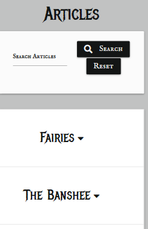
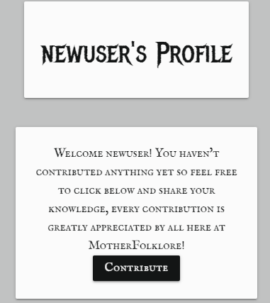
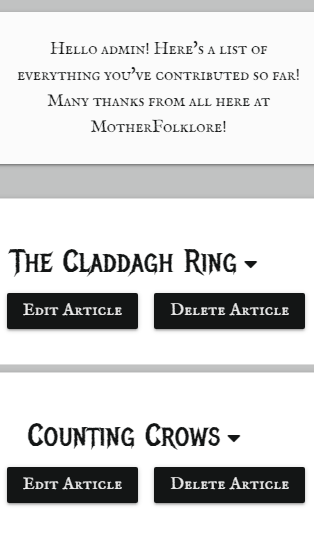
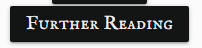
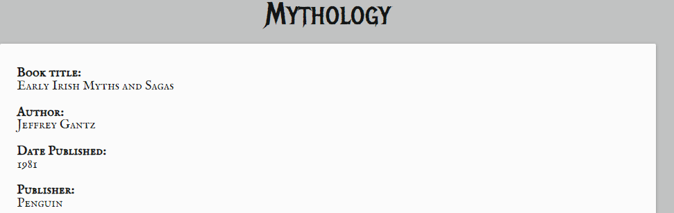
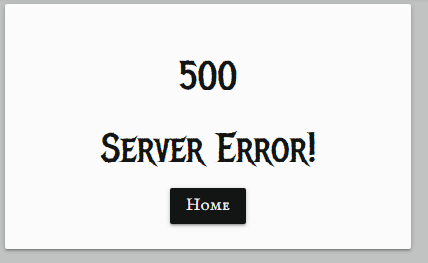
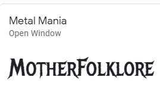
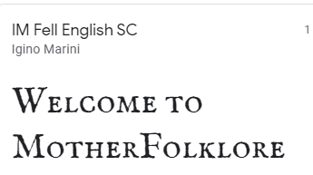

# Contents
* [UX](#UX)
    * [Strategy](#Strategy)
       * [Project Goals](#Project-Goals)
       * [User Stories](#User-Stories) 
    * [Structure](#Structure)
       * [Existing Features](#Existing-Features) 
            * [Features on all pages](#Features-on-all-pages)
            * [Home Page Features](#Home-Page-Features)
            * [Articles Page Features](#Articles-Page-Features)
            * [Login Page Features](#Login-Page-Features)
            * [Sign-Up Page Features](#Sign-Up-Page-Features)
            * [Profile Page Features](#Profile-Page-Features)
            * [Topics Page Features](#Topics-Page-Features)
            * [Further Reading Page Features](#Further-Reading-Page-Features)  
            * [Log Out Features](#Log-Out-Features)
            * [404 Page](#404-Page)
            * [500 Page](#500-Page)
            * [Features exclusive to Admin][#Features-exclusive-to-Admin]          
       * [Features Left To Implement](Feature-Left-To-Implement)  
       * [Design](#Design)
            * [Colors](#Colors)
            * [Typography](#Imagery)
            * [Imagery](#Imagery)    
    * [Skeleton](#Skeleton)
      * [Wireframes](#Wireframes)
      * [Database Schema](#Database-Schema)
      * [Sitemap](#Sitemap)
    * [Technolgies Used](#Technologies-Used)
    * [Testing](#Testing)
    * [Deployment](#Deployment)
      * [Deployment Steps](#Deployment-Steps) 
      * [Making a clone to run locally](#Making-a-clone-to-run-locally)
      * [How to Fork the respository](#How-to-Fork-the-Respository)
    * [Credits](#Credits)
      * [Media](#Media)
      * [Content](#Content)
      * [Code](#Code)
      * [Acknowledgements](#Acknowledgements)

# MotherFolklore

The live website can be viewed [here](https://motherfolklore.herokuapp.com/)

# UX

## Strategy

### Project Goals
The primary goal of this site is to facilitate Irish History lovers to be able to read and share local history from their regions. It was inspired by the [Three Castles Burning Podcast](https://threecastlesburning.libsyn.com/) which deals with lesser-known tales and folklore from the capital. The primary goal of the site is to allow site users to share lesser-known stories from the rest of the country and perhaps debunk some well-kept myths too. 

**The Ideal User of this site:**
* Is English speaking.
* Has a passion for history. 
* Is Interested in local lore.
* Has a curiosity about their provincial area.
* Wants to learn more about Irish History. 
  

### User Stories

* As a first-time user I want to know the main purpose of the site immediately upon arriving on the site.
* As a first-time user I want to be able to easily access information about local Irish folklore.
* As a first-time user I want the site UX to be intuitive for ease of use. 
* As a returning user, I want to be able to register with the site and create my own profile which I can log in to at any time.
* As a returning user, I want to be able to add local history of my own to the site.
* As a returning user, I want to be able to edit/delete any contribution I have made to the site. 
* As a user I want the site to be responsive to all devices.
* As a user I want to be able to contact the admin with any queries or suggestions I may have.
* As a user I want to be able to find out further information about local Irish history through links to additional material and literature provided by the site.

# Structure

## Existing Features

### Features on all pages:
* Navbar
* Footer
* Social Media Icons

### Home page features:
* A parallax container displays the two images described in the Design section below.
* A card is displayed to the user describing the site's purpose. 
* If the user is not signed in there are two call to action buttons, one which invites the user to register an account with the site and another which asks current users to sign in as seen in the image below. 

* If the user is  signed in there are three call to action buttons, one which invites the user to make an article contribution, visit the articles page or visit the topics page to promote easy of use.

### Articles page features:
* The Articles Page contains a search bar where users can search for keywords that appear in:
    * The Article Name
    * The Article Content
    * The Topic Name

* Beneath the search bar there are a series of collapsible dropdowns which contain:
    * The article content
    * The article image
    * The location where the story of the article content originates
    * The name of the user who created the content
    * The date on which the article was created. 
    * If the article is the property of the session owner then delete and edit buttons appear alongside the article name.

    

    

    

* The edit and delete buttons allow the user to modify or erase their contribution respectively. A flash message appears to indicate whether the selected action was completed successfully. If the edit button is selected the user is redirected to the edit page where they are presented with an identical form to the add article form however the input fields are filled with the material they wish to edit in keeping with good UX design principles. If the delete button is selected a modal appears to confirm that the user wishes to delete their contribution so as to avoid accidental erasure of any material. 

* Beneath the collapsible dropdowns appears the pagination links which allow the user to navigate throughout the entire selection of articles and articles are limited to six per page using flask paginate. 

* A last minute feature to this page is the float back to top button which allows users to navigate back to the top of the screen if the material they are reading is quite lenghty. It is has not been fully implemented to the developer's specifications due to its last minute implementation and will be a feature to be considered for modification in the future. 

### Login page features:

* A parallax container displays the two images described in the Design section below. 
* A Log in form is presented to the user which asks for their username and password which are validated by the login route handler. An image of the login form can be seen below.

### Sign-Up page features:

* A parallax container displays the two images described in the Design section below. 
* A register form is presented to the user which asks for their username, email address and password which are validated by the sign route handler. The password must be declared twice to ensure it matches or else the user will be notified that their passwords do not match. This is done to ensure that the user has input a password that they are familiar with and can remember and to avoid any possible typos that could hinder the user from signing in in the future. An image of the registration form can be seen below.

### Profile page features:
* A parallax container displays the two images described in the Design section below.

* Beneath the parallax container a welcome message is displayed. If the user has not made any site contributions there will be a call to action button inviting them to do so as seen below:

* If the user has made some site contributions a welcome message is displayed thanking them for their site contributions and all of their site contributions are displayed immediately beneath this message with edit and delete buttons for ease of use as seen below:

### Topics page features:
* The topics page presents the user with a series of topics through which they can filter the articles which they wish to look at. 

* The user can enable this filter function by clicking the view button.

* The topics page also allows the user to filter the further reading page so that they can view external source material based on that specific topic by clicking the further reading button. 

### Further Reading page features:

* The further reading page allows users to view external source material which is filtered based on topic as seen in the image below.

### Logout features:
* The log out button removes the user's session cookie from the app using the pop method and redirects the user to the login page.

### 404 Page
* A 404 Page has been created in order to deal with user errors in navigation or invalid search data in order to assist the user in returning to the home page. All navigation features are present on the 404 page as well as a button labeled 'home' in order to easily redirect the user back to the relevant page.

### 500 Page 
* A 500 page has been created to deal with any potential internal server errors.

### Features exclusive to Admin:

* Only the Admin can edit/delete all articles content on the site, otherwise the content must belong to the session user in order for it to be edited or deleted. 
* Only Admin can add new topics to the topics page.
* Only Admin can edit/delete existing topics on the topics page.
* Only Admin can add new material to the further reading page.
* Only Admin can edit/delete material on the further reading page.

## Features left to implement

* The floating back to top button on the articles page was created not long before project submission and because of this it was not possible to concentrate this button specifically inside the collapsible body div container. This hinders the UX because the user is brought to the top of the screen instead of the top of the article container, this issue will  be resolved at a later date.

* During the development of this project it quickly became apparent that the scope of the project could easily become infinite. Due to time constraints and the limitations of the site creator's skillset all other possible future features were dismissed to prevent scope creep. Possible future features will be re-evaluated at a later date but for now there are no features left to implement because it was felt that too many features could hamper creating a site built on the principles of good UX design. 

## Design

### Colors

* The colors of this site were chosen in order to replicate the feel of old newspapers and books. It's a simple black and white monochrome palette coupled with shades of grey so as not to overwhelm the user and to adhere to the principles of good UX design. They match the monochrome images that have been selected for this site. 

This palette was created on the [Coolors Website](https://coolors.co).

### Typography
* The 'Metal Mania' font was chosen for header text because of its striking style and historical feel as well as it's clarity. Other fonts that were found were perhaps more fitting in terms of how frequently they were used in the past but in order to stick with the principles of good UX the aforementioned font was chosen based on its readability.

* The 'IM Fell English SC' was chosen based on its similarity to the text often found in older literature in order to enhance the historic feel of the site and promote a positive user experience.

* Both fonts were found on [Google Fonts](https://fonts.google.com/)

### Imagery
* The Children of Lir image was selected because it matched the subject matter and the color scheme of the site. It appears to be an image that may have originated in an old out of print book which helps to create the overall feel of the site. One of the Admin created articles is the Children of Lir so that the user can learn about this image during their exploration of the site. 

* The Banshee image was selected for the same reason mentioned above. This image was originally depicted in the book "The Halfpenny Miscellany" from 1862 so it was chosen for its authenticity and the fact that it would help achieve the desired feel of site and it also features as one of the Admin created articles available on the site.

## Skeleton

### Wireframes

* The wireframes were created using [Balsamiq wireframes](https://balsamiq.com/)

* The wireframe mockup links can be found below:

* [Home Page Wireframes](assets/documentation/wireframes/MS3-homepage-wireframe.pdf)

* [Articles Page Wireframes](assets/documentation/wireframes/MS3-articles-wireframe.pdf)

* [Contact Page Wireframes](assets/documentation/wireframes/MS3-contact-wireframe.pdf)

* [Register Page Wireframes](assets/documentation/wireframes/MS3-register-wireframe.pdf)

* [Profile Page Wireframes](assets/documentation/wireframes/MS3-profile-wireframe.pdf)

* [Edit-Delete Page Wireframes](assets/documentation/wireframes/MS3-edit-delete-wireframe.pdf)

* [Login Page Wireframes](assets/documentation/wireframes/MS3-login-wireframe.pdf)

* [Add Article Page Wireframes](assets/documentation/wireframes/MS3-add-article-wireframe.pdf)

* [Topics Page Wireframes](assets/documentation/wireframes/MS3-topics-wireframe.pdf)

* [Further Reading Page Wireframes](assets/documentation/wireframes/MS3-fr-wireframe.pdf)

### Database Schema

* The site contains five collections which are stored in MongoDB. The users collection stores the user's username and password which enables the user to create an account and have a profile page. The articles collection stores all data related to the site's article content and also links to the user's collection if they have created site content using their account. All of their contributions are then linked and displayed to their profile page. The topics collection links to the article content by assigning articles a topic_name. This enables  the filter_topic functionality which allows users to filter articles by topic. The locations collection allows users to select a specific geographical location of the origin point of their article. Finally the further reading collection stores data related to external reading source material. It is also linked to the topics collection as all further reading data is filtered and presented to the user based on a specific topic. Only the Admin has clearance to edit/delete the data found in the topics and further reading collections. 

### Sitemap
* The sitemap was created using [Balsamiq wireframes](https://balsamiq.com/)

* A link to the [Sitemap can be found here](assets/documentation/wireframes/MS3-sitemap-wireframe.pdf)

## Technologies Used
- This project is primarily built using HTML5 semantic markup, CSS stylesheets, Javascript, Python, Flask and MongoDB.
- [Flask](https://flask.palletsprojects.com/en/2.0.x/)
    - Flask was used as the main python framework in the building of this project.
- [jQuery](https://jquery.com/)
    - This framework was used to create some of the site's interactive functions.
- [Gitpod](https://gitpod.io)
    - This project was built using Gitpod as the IDE.
- [Github](https://github.com/)
    - Github was used for online version control and storing files and documents.
- [Heroku](https://id.heroku.com/)
    - Heroku was used as a cloud based platform to deploy this site.
- [Google fonts](https://fonts.google.com/) 
    - The font styles used on this website were chosen from Google fonts.
- [Materializecss](https://materializecss.com/)
   - Various aspects of this website were structured using Materialize.
   - Materialize was used to make this website responsive
- [Fontawesome](https://fontawesome.com/)
    - The icons used on this page were found in Fontawesome.
- [MongoDB](https://www.mongodb.com/)
    - MongoDB Atlas was used as the database for the creation of this project.
- [Jinja](https://jinja.palletsprojects.com/en/3.0.x/)
    - Jinja was used for templating.
- [flask-paginate](https://pythonhosted.org/Flask-paginate/)
    - flask-paginate was used to create the site's pagination links.
- [Balsamiq](https://balsamiq.com/)
    - The wireframes and sitemap for this project were created using Balsamiq.
 - [Freeformatter- CSS beautifier](https://www.freeformatter.com/css-beautifier.html)
    - This was used to format the CSS stylesheet.
- [Freeformatter- HTML formatter](https://www.freeformatter.com/html-formatter.html)
    - This was used to format each HTML page
- [PEP8online](http://pep8online.com/)
    - PEP8 online was used to make sure all python code was pep8 compliant.
- [Google DevTools](https://developers.google.com/web/tools/chrome-devtools) 
    - Google Dev Tools was extensively used throughout the project for various styling and testing purposes. Its lighthouse feature was used as one of the main testing tools for this project.
- [EmailJS](https://www.emailjs.com/)
    - The contact-form was created using EmailJS following a code institute tutorial.
- [CSS-Tricks](https://css-tricks.com/)
    - This was used as a general reference resource.
- [Favicon.io](https://favicon.io/) 
    - This was used to create the site's favicon.
- [Am I Responsive](http://ami.responsivedesign.is/)
    - This was used to test the responsiveness of the site and also to create the mock-up image presented at the start of this document.
- [Beautifier.io](https://beautifier.io/)
    - Beautifier.io was used to format all javascript files in this project.
- [Dbdiagram.io](https://dbdiagram.io/home)
    - Dbdiagram.io was used to create the Database Schema presented in this document.
- [Coolors.co](https://coolors.co/)
    - Coolors.co was used to create the project's color palette.
- [StackOverflow](https://stackoverflow.com/)
    - Stack Overflow was used as a general reference resource. 

## Testing
Testing information can be found here in the separate [TESTING.md file](TESTING.md)

## Deployment
This project was developed using [Gitpod IDE](https://gitpod.io) and pushed to Github using the in-built terminal. However, because Github can only host static websites it was necessary to deploy this project to Heroku because it is a compatible hosting platform for a back-end focused site like MotherFolklore. 

This project was deployed using Heroku and stored in GitHub.

Before deploying the website to Heroku, the following three must be followed to allow the app to work in Heroku:
1. Create requirements.txt file that contains the names of packages being used in Python. It is important to update this file if other packages or modules are installed during project development by using the following command:

    - pip freeze --local > requirements.txt

2. Create Procfile that contains the name of the application file so that Heroku knows what to run. If the Procfile has a blank line when it is created remove this as this may cause problems.

3. Push these files to GitHub.
Once those steps are done, the website can be deployed in Heroku using the steps listed below:

### Deployment Steps

1. Log into Heroku.
2. Click the New button.
3. Click the option to create a new app.
4. Enter the app name in lowercase letters.
5. Select the correct geographical region.

### Set environment variables:

Navigate to the settings tab and then click the Reveal Config Vars button and add the following:

1. key: IP, value: 0.0.0.0
2. key: PORT, value: 5000
3. key: MONGO_DBNAME, value: (the name of the database that is being used for the project)
4. key: MONGO_URI, value:
 * This can be found in MongoDB by navigating  to the clusters section of your MongoDB account.
 * Click the cluster where the database is located.
 * Click the connect button.
 * Select the connect you application button.
 *  Copy the link provided to your application and ensure you have substituted the password and dbname with the correct values).
5. key: SECRET_KEY, value: (This is a custom secret key set up for configuration to keep client-side sessions secure).

### Enable automatic deployment:

1. Click the Deploy tab
2. In the Automatic deploys section, choose the branch you want to deploy from then click Enable Automation Deploys.

### Connect app to Github Repository

1. Click the deploy tab and connect to GitHub.
2. Type the name of the repository into the search bar presented.
3. Click the Code dropdown button next to the green Gitpod button.
4. When the correct repository displays click the connect button.

### Making a clone to run locally

It is important to note that this project will not run locally unless an env.py file has been set up by the user which contains the IP, PORT, MONGO_DBNAME, MONGO_URI and SECRET_KEY which have all been kept secret in keeping with best security practices. 

1. Log into GitHub.
2. Select the [respository](https://github.com/AideenM12/MotherFolklore-MS3).
3. Click the Code dropdown button next to the green Gitpod button.
4. Download ZIP file and unpackage locally and open with IDE. Alternatively copy the URL in the HTTPS box.
5. Open the alternative editor and terminal window.
6. Type 'git clone' and paste the copied URL.
7. Press Enter. A local clone will be created.

Once the project been loaded into the IDE it is necessary to install the necessary requirements which can be done by typing the following command.

    -pip install -r requirements.txt

### How to Fork the respository.

1. Log into GitHub.
2. In Github go to (https://github.com/AideenM12/MotherFolklore-MS3).
3. In the top right hand corner click "Fork".

## Credits

### Media
The church.jpg image was originally obtained from [wirestock on Freepik.com]('https://www.freepik.com/photos/vintage')
The childrenoflir.jpg was originally obtained from [yourirish.com](https://www.yourirish.com/folklore/children-of-lir)
The banshee3.jpg was originally obtained from [monstersandcritics.com](https://www.monstersandcritics.com/tv/josh-gates-destination-truth-goes-in-search-of-the-irish-banshee/)

### Content
* The information presented in the Fairies article was taken from [https://en.wikipedia.org/](https://en.wikipedia.org/wiki/Fairy)
* The information presented in the Banshee article was taken from [newworldencyclopedia.org](https://www.
newworldencyclopedia.org/entry/Banshee)

* The information presented in The Children of Lir article was taken from [shortkidstories.com](https://www.shortkidstories.com/story/children-lir/)

* The information presented in the St. Brigid's Cloak article was taken from [yourirish.com](https://www.yourirish.com/folklore/magic-cloak-st-brigid)

* The information presented in the Tír na nÓg article was taken from [explore.blarney.com](http://explore.blarney.com/tir-na-nog-the-story-of-niamh-and-oisin/)

* The information presented in the Pandemic that inspired Dracula article was taken from [rte.ie](https://www.rte.ie/news/connacht/2018/1110/1010033-dracula-sligo/)

* The information presented in the Yeats and Folklore article was taken from [shamrockgift.com](https://www.shamrockgift.com/blog/yeats-irish-folklore/)

* The information presented in the Counting Crows article was taken from [rte.ie](https://www.rte.ie/brainstorm/2020/1210/1183545-magpies-nursery-rhyme-superstitions/)

* The information presented in the Claddagh Ring article was taken from [theirishgifthouse.com](https://theirishgifthouse.com/contents/en-us/d2105420_Irish_Wedding_Traditions.html)

### Code

* The code for the floating back to top button was taken from [codepen.io](https://codepen.io/desirecode/pen/MJPJqV)

* The CSS Code for the bootstrap-style inline list was taken from [stackoverflow.com](https://stackoverflow.com/questions/42884750/how-to-create-inline-lists-in-materializecss)

* The code that appears over the parallax container on the home page was found on [codepen.io](https://codepen.io/j_holtslander/pen/NoKqQP)

* The code for the pagination links on the articles page was taken from Ed Bradley's [Self-Isolution Project](https://github.com/Edb83/self-isolution/blob/master/app.py)

* The code for the login and registration forms and route handlers was taken from the following links:
    - [pythonprogramming.net](https://pythonprogramming.net/flask-registration-tutorial/)
    - [WTForms.readthedocs.io](https://wtforms.readthedocs.io/en/stable/crash_course/)

* The email.js code was sourced from Matt Rudge's Code Institute tutorial on the same subject.

* A large portion of this project's code was inspired by Tim Nelson's mini project walkthrough tutorial. This Code Institute tutorial was instrumental in the creation of this site. 

* The TESTING.md section of this project was inspired by my classmate, Daisy McGirr's, workshop on testing. This workshop proved very useful for a great deal of students, myself included, in approaching all matters of testing. 

### Acknowledgements

* I would firstly like to thank my ever-patient mentor, Aaron Sinnott, whose guidance, knowledge and calm advice has been integral to the creation, development and completion of this project. 

* I would like to thank the entire slack community for being a source of support, knowledge and positive feedback throughout this project, in particular data-centric-dev channel lead Ed B who seemed to be constantly available to answer questions and troubleshoot solutions with students throughout the development of their third milestone projects.

* I would like to thank Daisy McGirr for taking time out of her busy schedule to provide us with the aforementioned testing workshop and for constantly offering encouragement and help to our Springboard class throughout our Code Institute journey.

* I would like to thank my own Springboard class cohorts for being supportive and helpful throughout the duration of the course. This particular channel provided a great deal of respite and also necessary feedback throughout the course which has proven invaluable for maintaining motivation. 

* Finally I would like to thank my boyfriend Shane for constantly helping to test the project throughout its development, providing insightful suggestions as to how to improve user experience. And also for helping to proof read this document and ensure it meets the correct standards of grammar, spelling and readability.