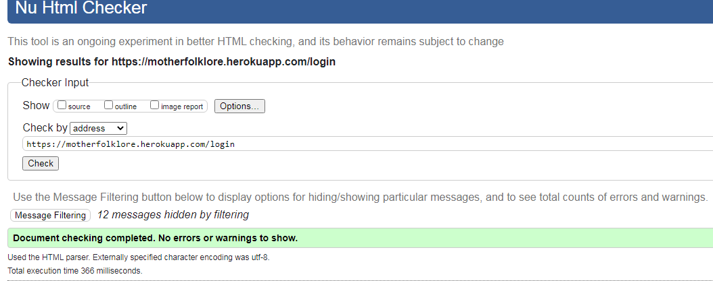

# Contents

   * [Testing User Stories](#Testing-User-Stories)
   * [Validators](#Validators)
      * [HTML Validators](#HMTL-Validators)
         * [HTML Pages](#HTML-Pages)
         * [Data Sensitive HTML Pages](#Data-Sensitive-HTML-Pages)
   * [Testing Features](#Testing-Features)
        * [Navigation](#Navigation)
        
        * [Social Media Links](#Social-Media-Links)
        * [Buttons and Solutions Functions](#Buttons-and-Solutions-Functions)
        * [Alerts](#Alerts)
        
        * [Contact Form](#Contact-Form)
        * [404 Page](#404-Page)
   * [Manual Testing of Route Handlers](#Manual-Testing-of-Route-Handlers)
   * [Site Responsiveness](#Site-Responsiveness)
   * [User Testing](#User-Testing)
   * [Known Bugs and Issues](#Known-Bugs-and-Issues)
   * [Further Testing](#Further-Testing) 

## Validators
### HTML 
All of the following HTML were validated by using [W3C Markup Validation Service](https://validator.w3.org/).

— **HTML Pages** —
* **Add Article Page** &#40; `add_article.html` &#41;:


* **Add Further Reading Page** &#40; `add_further_reading.html` &#41;:


* **Add Topic Page** &#40; `add_topic.html` &#41;:


* **Articles Page** &#40; `articles.html` &#41;:


* **Contact Page** &#40; `contact.html` &#41;:


* **Home Page** &#40; `index.html` &#41;:


* **Login Page** &#40; `login.html` &#41;:




* **Sign-Up Page** &#40; `sign-up.html` &#41;:


* **Topics Page** &#40; `topics.html` &#41;:


-— **Data Sensitive HTML Pages** —

Because some of the pages of the site contain an Object ID in the url the validation results of these pages are listed below instead of using photos.

* **Edit Article Page** &#40; `edit_article.html` &#41;: 0 Errors & 0 Warnings Found
* **Edit Topic Page** &#40; `edit_topic.html` &#41;: 0 Errors & 0 Warnings Found
* **Edit Further Reading Page** &#40; `edit_further_reading.html` &#41;: 0 Errors & 0 Warnings Found

### CSS
All CSS was validated by using [W3C Jigsaw CSS Validation Service](https://jigsaw.w3.org/css-validator/) with no issues detected. A screenshot of these results can be seen below:


### Javascript
* All Javascript code was passed through the [JShint](https://jshint.com/) validator with little to no issues with the exception of 'let' being available in ES6 and the '$' being recognised as an unused variable. Screenshots of the results of these files can be found below:

* **emailjs file**


* **scriptjs file**


### Python 
* The app.py file was passed through the [PEP8](http://pep8online.com/) validator and the results can be seen below:


## Manual Testing of Route Handlers
* In order to ensure each route handler performed correctly with regards to security features and defensive programming the following steps were taken to test each relevent route handler:
   1. Sign into MotherFolklore as Admin.
   2. Navigate to the relevant pages that are user/Admin specific and copy the relevant url.
   3. Sign Out as Admin.
   4. Sign in as a standard user.
   5. Paste the relevant url into the google search bar.
   6. Check to see if the page redirects as anticipated. 
      * If the page redirects this confirms that the route handler is functioning as expected and no content from this page can be altered/deleted by anyone other than the content's owner or the site Admin.
      * If the page does not redirect as expected then the route handler has failed to protect the site's content and needs to be fixed. 

### Edit Article Route Handler
* The above steps were implemented to test the edit article route handler. As indicated by the image below, this route handler was functioning as expected at the time of submission by redirecting the user to the articles page and subsequently passed this test. 

* 

### Add Topic Route Handler
* The above steps were implemented to test the add topic route handler. As indicated by the image below, this route handler was functioning as expected at the time of submission by redirecting the user to the topics page and subsequently passed this test. 

* 

### Edit Topic Route Handler
* The above steps were implemented to test the edit topic route handler. As indicated by the image below, this route handler was functioning as expected at the time of submission by redirecting the user to the topics page and subsequently passed this test. 

* 

### Add Further Reading Route Handler
* The above steps were implemented to test the add further reading route handler. As indicated by the image below, this route handler was functioning as expected at the time of submission by redirecting the user to the topics page and subsequently passed this test. 

* 

### Edit Further Reading Route Handler
* The above steps were implemented to test the edit further reading route handler. As indicated by the image below, this route handler was functioning as expected at the time of submission by redirecting the user to the topics page and subsequently passed this test. 

* 

* All delete functions do not display id specific urls at the time of deletion so similar tests could not be performed on these functions. However similar defensive programming has been implemented so as to prevent any malicious deletion of content and only allow content to be deleted by the the content's owner or the site admin.

## Known Bugs and Issues
* One known bug was the failure of the parallax container to render on the profile page. The initial file path was as follows on all pages that used these images:
 ```
 <div class="parallax-container login">
 <div class="parallax"> 
 </div>
 </div>
 ```
In order to trouble shoot the issue the following code was used to try and rectify the problem:
```
<div class="parallax-container">
		<div class="parallax"></div>
	  </div>
```
This code effectively resolved the issue without any problems. The issue was raised with the project's mentor but an explanation could not be found. For the sake of consistency all parallax containers now use the above file path to avoid any unforeseen or inexplicable issues. 

* Another troublesome bug was found on the topics page. Topics created on the site instead of the database failed to push articles into the database list array as can be seen in the images below:


After much consultation with tutor support it was discovered that Topics created on the site had failed to pass an empty string value into the MongoDB article list array as can be seen in the image below:


After this discovery and a great deal of trouble shooting the following code was added into the add_topic route handler to rectify the issue and ensure that the article list array was initialized with an empty string value: 
```
"article_list": [""]
```


## Further Testing

* Testing was performed in the following browsers on both laptop and mobile devices:
    - Google Chrome

    - Mozilla Firefox

    - Opera 

    - Microsoft Edge

    No issues were detected in any of these browsers at the time of submission.


    The below image is an example result of lighthouse testing performed on the index page for desktop with every other test achieving similar results. The lighthouse tool found in Google Dev Tools was used repeatedly throughout the building of the project and was essential in discovering and resolving the issues described in this document. A lighthouse test was performed on both mobile and desktop for each individual page on the site with links to the full reports of each of these tests found below. The lighthouse tool tested each of the following criteria: performance, accessibility, best practices and SEO of each individual page in both mobile and desktop. Each test often resulted in a score of 90 or above with the lowest score being 80.


    

* **Home Page**

    [Lighthouse Desktop Index page results](assets/documentation/doc-images/Homedesktop.pdf) |
    [Lighthouse Mobile Index page results](assets/documentation/doc-images/Homemobile.pdf)

* **Contact Page**

    [Lighthouse Desktop Contact page results](assets/documentation/doc-images/Contactdesktop.pdf) | 
    [Lighthouse Mobile Contact page results](assets/documentation/doc-images/Contactdesktop.pdf) 

* **Articles Page**

    [Lighthouse Desktop Articles page results](assets/documentation/doc-images/Articlesdesktop.pdf) | 
    [Lighthouse Mobile Articles page results](assets/documentation/doc-images/Articlesmobile.pdf) 

* **Sign-Up Page**

    [Lighthouse Desktop Sign-Up page results](assets/documentation/doc-images/Signupdesktop.pdf) | 
    [Lighthouse Mobile Sign-Up page results](assets/documentation/doc-images/Signupmobile.pdf) 

* **Log In Page**

    [Lighthouse Desktop Login page results](assets/documentation/doc-images/Logindesktop.pdf) | 
    [Lighthouse Mobile Login page results](assets/documentation/doc-images/Loginmobile.pdf) 

* **Profile Page**

    [Lighthouse Desktop Profile page results](assets/documentation/doc-images/Profiledesktop.pdf) | 
    [Lighthouse Mobile Profile page results](assets/documentation/doc-images/Profilemobile.pdf) 

* **Add Article Page**

    [Lighthouse Desktop Add Article page results](assets/documentation/doc-images/Add-articledesktop.pdf) | 
    [Lighthouse Mobile Add Article page results](assets/documentation/doc-images/Add-articlemobile.pdf) 

* **Edit Article Page**
   
    [Lighthouse Desktop Edit Article page results](assets/documentation/doc-images/Edit-articledesktop.pdf) | 
    [Lighthouse Mobile Edit Article page results](assets/documentation/doc-images/Edit-articlemobile.pdf)

* **Topics Page**

    [Lighthouse Desktop Topics page results](assets/documentation/doc-images/Topicsdesktop.pdf) | 
    [Lighthouse Mobile Topics page results](assets/documentation/doc-images/Topicsmobile.pdf)

* **Add Topic Page**

    [Lighthouse Desktop Add Topic page results](assets/documentation/doc-images/Add-topicdesktop.pdf) | 
    [Lighthouse Mobile Add Topic page results](assets/documentation/doc-images/Add-topicmobile.pdf)

* **Edit Topic Page**

    [Lighthouse Desktop Edit Topic page results](assets/documentation/doc-images/Edit-topicdesktop.pdf) | 
    [Lighthouse Mobile Edit Topic page results](assets/documentation/doc-images/Edit-topicmobile.pdf)

* **Further Reading Page**

    [Lighthouse Desktop Further Reading page results](assets/documentation/doc-images/Further-readingdesktop.pdf) | 
    [Lighthouse Mobile Further Reading page results](assets/documentation/doc-images/Further-readingmobile.pdf)

* **Add Further Reading Page**

    [Lighthouse Desktop Add Further Reading page results](assets/documentation/doc-images/Add-fr-desktop.pdf) | 
    [Lighthouse Mobile Add Further Reading page results](assets/documentation/doc-images/Add-fr-mobile.pdf)

* **Edit Further Reading Page**

    [Lighthouse Desktop Edit Further Reading page results](assets/documentation/doc-images/Edit-fr-desktop.pdf) | 
    [Lighthouse Mobile Edit Further Reading page results](assets/documentation/doc-images/Edit-fr-mobile.pdf)
