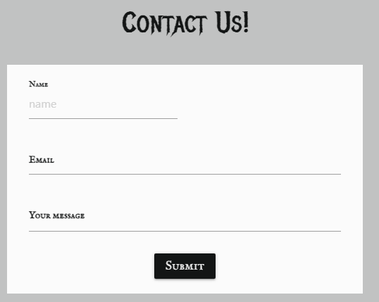
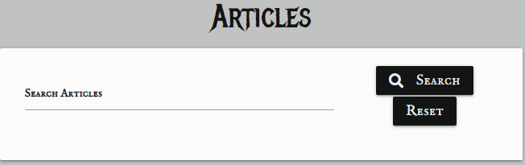

# Contents

   * [Testing User Stories](#Testing-User-Stories)
   * [Validators](#Validators)
      * [HTML Validators](#HMTL-Validators)
         * [HTML Pages](#HTML-Pages)
         * [Data Sensitive HTML Pages](#Data-Sensitive-HTML-Pages)
   * [Testing Features](#Testing-Features)
        * [Navigation](#Navigation)
        
        * [Social Media Links](#Social-Media-Links)
        * [Buttons and Solutions Functions](#Buttons-and-Solutions-Functions)
        * [Alerts](#Alerts)
        
        * [Contact Form](#Contact-Form)
        * [404 Page](#404-Page)
   * [Manual Testing of Route Handlers](#Manual-Testing-of-Route-Handlers)
   * [Site Responsiveness](#Site-Responsiveness)
   * [User Testing](#User-Testing)
   * [Known Bugs and Issues](#Known-Bugs-and-Issues)
   * [Further Testing](#Further-Testing) 

## Testing User Stories

### Test Case 1

> As a first time user I want to know the main purpose of the site immediately upon arriving on the site.

**Description**
Verify that the site's purpose is explicitly clear when a user navigates to the site landing page.

**Steps**
1. Open one's internet browser of choice.
2. Navigate to [https://motherfolklore.herokuapp.com/](https://motherfolklore.herokuapp.com/)
3. Scroll to the content directly beneath the site's first image.
4. Read the site description directly beneath the image in order to understand the site's purpose.

**Expected Result:**
A card container with text explaining the site's purpose will be displayed beneath the first image.

**Actual Result:**
A card container with text explaining the site's purpose is displayed beneath the first image.

**Pass/Fail:**
Pass

**Image of Test Result:** 


---

### Test Case 2

> As a first time user I want to be able to easily access information about local Irish folklore.

**Description**
Verify that the site.

**Steps**
1. Open one's internet browser of choice.
2. Navigate to [https://motherfolklore.herokuapp.com/](https://motherfolklore.herokuapp.com/)
3. Select the articles tab in the navigation bar.
4. Scroll down the page to find a suitable article of choice to read more about Irish folklore and use pagination links to view the entire article content available.
5. Click on the title of the article of choice.
6. Read article of choice.

**Expected Result:**
A collapsible dropdown container will display the user's article of choice.

**Actual Result:**
A collapsible dropdown container displays the user's article of choice.

**Pass/Fail:**
Pass

**Image of Test Result:** 


---

### Test Case 3

> * As a first time user I want the site UX to be intuitive for ease of use.

**Description**
Verify that the site provides the user with an intuitively designed navigation bar and footer.

**Steps**
1. Open one's internet browser of choice.
2. Navigate to [https://motherfolklore.herokuapp.com/](https://motherfolklore.herokuapp.com/)
3. Select the tab of choice in the navigation bar.
4. Alternatively create an account for a greater depth of user experience.
5. Use the navigation and footer links to explore the site and find desired content/services.
6. Logout once site exploration has concluded.

**Expected Result:**
A navigation bar will provide the user with links to the site's content that they can use intuitively. A series of footer icons will provide the user with links to the site's social media accounts.

**Actual Result:**
A navigation bar provides the user with links to the site's content that they can use intuitively. A series of footer icons provide the user with links to the site's social media accounts.

**Pass/Fail:**
Pass

**Image of Test Result:** 


---

### Test Case 4

> * As a returning user I want to be able to register with the site and create my own profile which I can log in to at any time.

**Description**
Verify that the site provides the user with an opportunity to register with the site and create their own account.

**Steps**
1. Open one's internet browser of choice.
2. Navigate to [https://motherfolklore.herokuapp.com/](https://motherfolklore.herokuapp.com/)
3. Select the Sign Up tab in the navigation bar.
4. Fill in the registration form as instructed.
5. Once the registration form has been successfully filled out and submitted the user will be notified that the creation of their account has been successful.


**Expected Result:**
A registration form will be provided and once successfully completed and submitted the user will be notified that their account creation has been successful.

**Actual Result:**
A registration form is provided and once it is successfully completed and submitted the user is notified that their account creation has been successful.

**Pass/Fail:**
Pass

**Image of Test Result:** 


---

### Test Case 5

> * As a returning user I want to be able to add local history of my own to the site.

**Description**
Verify that the site provides the user with an opportunity to contribute their own content to the site.

**Steps**
1. Open one's internet browser of choice.
2. Navigate to [https://motherfolklore.herokuapp.com/](https://motherfolklore.herokuapp.com/)
3. Select the Log In tab in the navigation bar.
4. Enter user's log in details.
5. After logging in select the contribute tab in the navigation bar.
6. Fill in the add an article form with one's desired information that they wish to contribute to the site.
7. Once the form has been correctly filled in click the add article button.
8. The user will then receive a notification that their contribution has been successful.


**Expected Result:**
An add an article form will be provided and once successfully completed and submitted the user will be notified that their article contribution has been successful.

**Actual Result:**
An add an article form is provided and once successfully completed and submitted the user is notified that their article contribution has been successful.

**Pass/Fail:**
Pass

**Image of Test Result:** 


---

### Test Case 6

> * As a returning user I want to be able to edit/delete any contribution I have made to the site.

**Description**
Verify that the site provides the user with an opportunity to edit and delete their own content on the site.

**Steps to Edit**
1. Open one's internet browser of choice.
2. Navigate to [https://motherfolklore.herokuapp.com/](https://motherfolklore.herokuapp.com/)
3. Select the Log In tab in the navigation bar.
4. Enter user's log in details.
5. After logging in view user's own content on the profile page.
6. Click the edit button on the content that you wish to edit.
7. Make the necessary alterations in the edit form provided.
8. Click the the edit article button.
9. The user will recieve a notification that their edit has been successful.


**Expected Result:**
An edit article form will be provided and once successfully completed and submitted the user will be notified that their article edit has been successful.

**Actual Result:**
An edit article form is provided and once successfully completed and submitted the user is notified that their article edit has been successful.

**Pass/Fail:**
Pass

**Image of Test Result:** 

* 


* 

* 

**Steps to Delete**
1. Open one's internet browser of choice.
2. Navigate to [https://motherfolklore.herokuapp.com/](https://motherfolklore.herokuapp.com/)
3. Select the Log In tab in the navigation bar.
4. Enter user's log in details.
5. After logging in view user's own content on the profile page.
6. Click the delete button on the content that you wish to edit.
7. Read the modal alert provided.
8. Click the delete button if you wish to delete the selected material.
9. The user will recieve a notification that their deletion has been successful.


**Expected Result:**
A delete button will be provided next to the users own content and once successfully clicked a modal will appear to confirm the users choice. Once the delete button in the modal has been selected the material will be permanently deleted and the user will receive a notification to say the deletion has been successful.

**Actual Result:**
A delete button is provided next to the users own content and once successfully clicked a modal appears to confirm the users choice. Once the delete button in the modal is selected the material is permenantly deleted and the user receives a notification to say the deletion has been successful.

**Pass/Fail:**
Pass

**Image of Test Result:** 

* 

* 

* 
---

### Test Case 7

> As a user I want the site to be responsive to all devices.

**Description**
Verify that the site is responsive on all devices.

**Steps**
1. Open one's internet browser of choice on one's device of choice.
2. Navigate to [https://motherfolklore.herokuapp.com/](https://motherfolklore.herokuapp.com/)
3. Test the responsiveness of the site on each available device.
4. Document the results.

**Expected Result:**
The site will be responsive across all available devices.

**Actual Result:**
* The website was primarily tested on the following devices:

    - Hp Pavilion g series laptop
    - Samsung A10

* Other devices used for site testing include:

    - HP 250 G6 Notebook PC 
    - Huawei P smart 2020
    - Iphone SE
    - Samsung A70

* Other tests performed to determine site responsiveness were conducted using google Dev Tools in order to view the site on a variety of devices. The [Am I Responsive](http://ami.responsivedesign.is/) website was also used to test the visual presentation of the site on different devices.

**Pass/Fail:**
Pass

**Image of Test Result:** 


---

### Test Case 8

> * As a user I want to be able to contact the admin with any queries or suggestions I may have.

**Description**
Verify that the site provides the user with a contact page so that they can contact the site's admin with any queries they may have.

**Steps**
1. Open one's internet browser of choice.
2. Navigate to [https://motherfolklore.herokuapp.com/](https://motherfolklore.herokuapp.com/)
3. Select the Log In tab in the navigation bar.
4. Enter user's log in details.
5. After logging in navigate to the contact page.
6. Fill out the contact form with the relevant information and click submit.
7. Once the contact form has been successfully filled out and submitted the user will receive a notification.


**Expected Result:**
A contact form will be provided and once successfully completed and submitted the user will be notified that their message has been successfully sent.

**Actual Result:**
A contact form is provided and once successfully completed and submitted the user is notified that their message has been successfully sent.

**Pass/Fail:**
Pass

**Image of Test Result:** 




---

### Test Case 9

> * As a user I want to be able to find out further information about local Irish history through links to additional material and literature provided by the site.

**Description**
Verify that the site provides the user with a further reading page so that they can delve deeper into the subject matter that interests them with additional reading material.

**Steps**
1. Open one's internet browser of choice.
2. Navigate to [https://motherfolklore.herokuapp.com/](https://motherfolklore.herokuapp.com/)
3. Select the Log In tab in the navigation bar.
4. Enter user's log in details.
5. After logging in navigate to the topics page.
6. Click the further reading button underneath the topic of choice.
7. Observe the bibliography of further reading provided on the topic of choice.


**Expected Result:**
A further reading page will be provided to allow the user to study their topic of choice in more depth.

**Actual Result:**
A further reading page is provided to allow the user to study their topic of choice in more depth.

**Pass/Fail:**
Pass

**Image of Test Result:** 

* 

* 

* 

---
## Testing Features

### Navigation

**Description**
Verify that all navigation bar tabs work as expected.

**Steps**
1. Open your web browser of choice.
2. Navigate to [https://motherfolklore.herokuapp.com/](https://motherfolklore.herokuapp.com/)
3. As an unsigned-in user click each of the navigation bar tabs to ensure they direct to the expected page.
4. Repeat step three as a signed-in user.

**Expected Result:**
Each of the links in the navigation bar will direct the user to the desired site page.

**Actual Result:**
Each of the links in the navigation bar directs the user to the desired site page.

**Pass/Fail:**
Pass

---

### Footer

**Description**
Verify that the site footer is present and responsive on all devices across all pages as expected.

**Steps**
1. Open your web browser of choice.
2. Navigate to [https://motherfolklore.herokuapp.com/](https://motherfolklore.herokuapp.com/)
3. As a signed-in user click each of the navigation bar tabs to ensure the footer is present on each page.
4. Repeat step three on all available devices to check responsiveness.

**Expected Result:**
A page footer will be visible on all devices across all pages.

**Actual Result:**
A page footer is visible on all devices across all pages.

**Pass/Fail:**
Pass

---

### Social Media Icons

**Description**
Verify that all social media icons redirect to the relevant pages in a new tab as expected.

**Steps**
1. Open your web browser of choice.
2. Navigate to [https://motherfolklore.herokuapp.com/](https://motherfolklore.herokuapp.com/)
3. Click each of the social media icons to ensure they direct to the expected page in a new tab.

**Expected Result:**
All social media icons will redirect to the relevant pages in a new tab.

**Actual Result:**
All social media icons redirect to the relevant pages in a new tab.

**Pass/Fail:**
Pass

---

### Home Page Features

**Description**
Verify that all home page features function as expected.

**Steps**
1. Open your web browser of choice.
2. Navigate to [https://motherfolklore.herokuapp.com/](https://motherfolklore.herokuapp.com/)
3. Observe the parallax container containing the site's focal imagery.
4. Observe the card container explaining the site's purpose.
5. If the user isn't signed in:
    - Observe the Register and Log in call to action buttons.
6. If the user is signed in:
    - Observe the articles, topics and contribute call to action buttons.

**Expected Result:**
All home page features will appear present as described in the above steps.

**Actual Result:**
All home page features appear present as described in the above steps.

**Pass/Fail:**
Pass

**Image of Test Result:**


---

### Article Page Features

-— **Article Page Search Bar** —

**Description**
Verify that the article page search bar functions as expected.

**Steps**
1. Open your web browser of choice.
2. Navigate to [https://motherfolklore.herokuapp.com/](https://motherfolklore.herokuapp.com/)
3. Navigate to the articles page.
4. Type a site content-related query into the search bar.
5. Observe the search results.

**Expected Result:**
If the search query is related to the article content present on the site a search result will render. If the search query is unrelated to the site content a notification will display to notify the user. 

**Actual Result:**
If the search query is related to the article content present on the site a search result renders. If the search query is unrelated to the site content a notification displays to notify the user.

**Pass/Fail:**
Pass

**Image of Test Result:**

* 

* 

* 


-— **Article Dropdown Containers** —

**Description**
Verify that the article page dropdown containers function as expected.

**Steps**
1. Open your web browser of choice.
2. Navigate to [https://motherfolklore.herokuapp.com/](https://motherfolklore.herokuapp.com/)
3. Navigate to the articles page.
4. Click on the title of the article of choice.
5. Observe the article content contained in the dropdown container.

**Expected Result:**
The article dropdown container will drop to display the desired article content. 

**Actual Result:**
The article dropdown container drops to display the desired article content.

**Pass/Fail:**
Pass

**Image of Test Result:**

* 

* 

-— **Article Page Edit and Delete Buttons** —

* The edit and delete button functionality are discussed in the [Manual Testing of Route Handlers](#Manual-Testing-of-Route-Handlers) section below.

-— **Article Page Float to top Button** —

**Description**
Verify that the article page float back to top button functions as expected.

**Steps**
1. Open your web browser of choice.
2. Navigate to [https://motherfolklore.herokuapp.com/](https://motherfolklore.herokuapp.com/)
3. Navigate to the articles page.
4. Scroll down until the float back to top button appears in the bottom right corner.
5. Click the button to scroll back to the top of the page.


**Expected Result:**
The article page float back to top button will navigate the user back to the top of the page. 

**Actual Result:**
The article page float back to top button navigates the user back to the top of the page. 

**Pass/Fail:**
Pass

---

### Login Page Features

* The Log In functionality testing is discussed in the above [Testing User Stories](#Testing-User-Stories) section.

---

### Sign-Up Page Features

* The Sign-Up functionality testing is discussed in the above [Testing User Stories](#Testing-User-Stories) section.

---

### Profile Page Features

* The Profile page functionality testing is discussed in the above [Testing User Stories](#Testing-User-Stories) section.

---

### Topics page features:

**Description**
Verify that all of the topics page features function as expected.

**Steps**
1. Open your web browser of choice.
2. Navigate to [https://motherfolklore.herokuapp.com/](https://motherfolklore.herokuapp.com/)
3. Sign In to the user account.
4. Navigate to the topics page.
5. Click on the view button beneath the desired topic.
6. Observe the articles that have been filtered by topic.

**Expected Result:**
The view buttons on the topics page will filter articles based on topic.

**Actual Result:**
The view buttons on the topics page filters articles based on topic.

**Pass/Fail:**
Pass

---

### Further Reading page features:

**Description**
Verify that the further reading page features function as expected.

**Steps**
1. Open your web browser of choice.
2. Navigate to [https://motherfolklore.herokuapp.com/](https://motherfolklore.herokuapp.com/)
3. Sign In to the user account.
4. Navigate to the topics page.
5. Click on the further reading button beneath the desired topic.
6. Observe the further reading source material that has been filtered by topic.

**Expected Result:**
The further reading buttons on the topics page will filter further reading material based on topic.

**Actual Result:**
The further reading buttons on the topics page will filter further reading material based on topic.

**Pass/Fail:**
Pass

---

### Log Out features:

**Description**
Verify that the Log Out feature functions as expected.

**Steps**
1. Open your web browser of choice.
2. Navigate to [https://motherfolklore.herokuapp.com/](https://motherfolklore.herokuapp.com/)
3. Sign In to the user account.
4. Click on the Log Out tab on the navigation bar.
5. Observe the Log Out successful message.

**Expected Result:**
The Log Out button will remove the user's session cookie from the app using the pop method and redirects the user to the login page.


**Actual Result:**
The Log Out button removes the user's session cookie from the app using the pop method and redirects the user to the login page.


**Pass/Fail:**
Pass

**Image of Test Result:**


---

### 404 Page:

**Description**
Verify that the 404 page functions as expected.

**Steps**
1. Open your web browser of choice.
2. Navigate to [https://motherfolklore.herokuapp.com/](https://motherfolklore.herokuapp.com/)
3. Type in an incorrect URL.
4. Observe the rendered 404 page.

**Expected Result:**
A 404 page will render if the user tries to direct to a non existent page.


**Actual Result:**
A 404 page renders if the user tries to direct to a non existent page.


**Pass/Fail:**
Pass

**Image of Test Result:**


---

### 500 Page:

**Description**
Verify that a 500 page exists to handle internal server errors as expected.

**Steps**
1. Open the motherfolklore gitpod workspace.
2. Navigate to the app.py file.
3. Inside the app.py file navigate to the index page route handler.
4. Change return render template value to 1/0.
5. Navigate to [https://motherfolklore.herokuapp.com/](https://motherfolklore.herokuapp.com/)
6. Observe the rendered 500 page.

**Expected Result:**
A 500 page will render if there is an internal server error.


**Actual Result:**
A 500 page renders if there is an internal server error.


**Pass/Fail:**
Pass

**Image of Test Result:**


---

### Features exclusive to Admin:
* The functionality exclusive to the site's Admin is discussed in the [Manual Testing of Route Handlers](#Manual-Testing-of-Route-Handlers) section below.

## Validators

### HTML 
All of the following HTML were validated by using [W3C Markup Validation Service](https://validator.w3.org/).

— **HTML Pages** —
* **Add Article Page** &#40; `add_article.html` &#41;:


* **Add Further Reading Page** &#40; `add_further_reading.html` &#41;:


* **Add Topic Page** &#40; `add_topic.html` &#41;:


* **Articles Page** &#40; `articles.html` &#41;:


* **Contact Page** &#40; `contact.html` &#41;:


* **Home Page** &#40; `index.html` &#41;:


* **Login Page** &#40; `login.html` &#41;:


* **Sign-Up Page** &#40; `sign-up.html` &#41;:


* **Topics Page** &#40; `topics.html` &#41;:


-— **Data Sensitive HTML Pages** —

Because some of the pages of the site contain an Object ID in the url the validation results of these pages are listed below instead of using photos.

* **Edit Article Page** &#40; `edit_article.html` &#41;: 0 Errors & 0 Warnings Found
* **Edit Topic Page** &#40; `edit_topic.html` &#41;: 0 Errors & 0 Warnings Found
* **Edit Further Reading Page** &#40; `edit_further_reading.html` &#41;: 0 Errors & 0 Warnings Found

### CSS
All CSS was validated by using [W3C Jigsaw CSS Validation Service](https://jigsaw.w3.org/css-validator/) with no issues detected. A screenshot of these results can be seen below:


### Javascript
* All Javascript code was passed through the [JShint](https://jshint.com/) validator with little to no issues with the exception of 'let' being available in ES6 and the '$' being recognised as an unused variable. Screenshots of the results of these files can be found below:

* **emailjs file**


* **scriptjs file**


### Python 
* The app.py file was passed through the [PEP8](http://pep8online.com/) validator and the results can be seen below:


## Linters
10 notifications remain in the terminal. The linter has raised issues regarding the 'env.py' file as expected because it contains sensitive material. The other linting notifications regarding the WTForm package imports were left untouched so as not to interfere with this package's security functions. 5 warnings appear with regard to the flask-pagination functionality which were again left untouched because this is borrowed code taken directly from another project so it was felt that it was best to leave it as it was found to maintain its functionality.


## Manual Testing of Route Handlers
* In order to ensure each route handler performed correctly with regards to security features and defensive programming the following steps were taken to test each relevant route handler:
   1. Sign into MotherFolklore as Admin.
   2. Navigate to the relevant pages that are user/Admin specific and copy the relevant url.
   3. Sign Out as Admin.
   4. Sign in as a standard user.
   5. Paste the relevant url into the google search bar.
   6. Check to see if the page redirects as anticipated. 
      * If the page redirects this confirms that the route handler is functioning as expected and no content from this page can be altered/deleted by anyone other than the content's owner or the site Admin.
      * If the page does not redirect as expected then the route handler has failed to protect the site's content and needs to be fixed. 

### Edit Article Route Handler
* The above steps were implemented to test the edit article route handler. As indicated by the image below, this route handler was functioning as expected at the time of submission by redirecting the user to the articles page and subsequently passed this test. 

* 

### Add Topic Route Handler
* The above steps were implemented to test the add topic route handler. As indicated by the image below, this route handler was functioning as expected at the time of submission by redirecting the user to the topics page and subsequently passed this test. 

* 

### Edit Topic Route Handler
* The above steps were implemented to test the edit topic route handler. As indicated by the image below, this route handler was functioning as expected at the time of submission by redirecting the user to the topics page and subsequently passed this test. 

* 

### Add Further Reading Route Handler
* The above steps were implemented to test the add further reading route handler. As indicated by the image below, this route handler was functioning as expected at the time of submission by redirecting the user to the topics page and subsequently passed this test. 

* 

### Edit Further Reading Route Handler
* The above steps were implemented to test the edit further reading route handler. As indicated by the image below, this route handler was functioning as expected at the time of submission by redirecting the user to the topics page and subsequently passed this test. 

* 

* All delete functions do not display id specific urls at the time of deletion so similar tests could not be performed on these functions. However similar defensive programming has been implemented so as to prevent any malicious deletion of content and only allow content to be deleted by the the content's owner or the site admin.

## Known Bugs and Issues
* One known bug was the failure of the parallax container to render on the profile page. The initial file path was as follows on all pages that used these images:
 ```
 <div class="parallax-container login">
 <div class="parallax"> 
 </div>
 </div>
 ```
In order to trouble shoot the issue the following code was used to try and rectify the problem:
```
<div class="parallax-container">
		<div class="parallax"></div>
	  </div>
```
This code effectively resolved the issue without any problems. The issue was raised with the project's mentor but an explanation could not be found. For the sake of consistency all parallax containers now use the above file path to avoid any unforeseen or inexplicable issues. 

* Another troublesome bug was found on the topics page. Topics created on the site instead of the database failed to push articles into the database list array as can be seen in the images below:


After much consultation with tutor support it was discovered that Topics created on the site had failed to pass an empty string value into the MongoDB article list array as can be seen in the image below:


After this discovery and a great deal of trouble shooting the following code was added into the add_topic route handler to rectify the issue and ensure that the article list array was initialized with an empty string value: 
```
"article_list": [""]
```

* One small bug which was encountered during development was that when the further reading page was rendered on small screens the text overlapped itself as seen in the image below:


The original that caused this issue is as presented below:
```
<p><span class="highlight">Website:</span> {{ reading.website }}</p><br>
   
   
   <p><span class="highlight"> Article title:</span> {{ reading.article_title }}</p><br>
   
   <p><span class="highlight">Author:</span>{{ reading.author }}</p><br>
   <p><span class="highlight">Date Published:</span> {{ reading.date_published }}</p><br>
   <p><span class="highlight">Publisher: </span> {{ reading.publisher }}</p><br>
```

In order to resolve this issue several different edits were made until the below code finally rectified the issue:
```
 <p class="highlight">Book title:</p>
            <p>{{ reading.book_title }}</p>
            <br>
            
            
            <p class="highlight">Website:</p>
            <p>{{ reading.website }}</p>
            <br>
            
            
            <p class="highlight"> Article title:</p>
            <p>{{ reading.article_title }}</p>
            <br>
            
            <p class="highlight">Author:</p>
            <p>{{ reading.author }}</p>
            <br>
            <p class="highlight">Date Published:</p>
            <p>{{ reading.date_published }}</p>
            <br>
            <p class="highlight">Publisher: </p>
            <p>{{ reading.publisher }}</p>
            <br>
```

* The floating back to top button on the articles page was created not long before project submission and because of this it was not possible to concentrate this button specifically inside the collapsible body div container. This hinders the UX because the user is brought to the top of the screen instead of the top of the article container, this issue will hopefully be resolved at a later date. 

## Further Testing

* Testing was performed in the following browsers on both laptop and mobile devices:
    - Google Chrome

    - Mozilla Firefox

    - Opera 

    - Microsoft Edge

    No issues were detected in any of these browsers at the time of submission.


    The below image is an example result of lighthouse testing performed on the index page for desktop with every other test achieving similar results. The lighthouse tool found in Google Dev Tools was used repeatedly throughout the building of the project and was essential in discovering and resolving the issues described in this document. A lighthouse test was performed on both mobile and desktop for each individual page on the site with links to the full reports of each of these tests found below. The lighthouse tool tested each of the following criteria: performance, accessibility, best practices and SEO of each individual page in both mobile and desktop. Each test often resulted in a score of 90 or above with the lowest score being 80.


    

* **Home Page**

    [Lighthouse Desktop Index page results](assets/documentation/doc-images/Homedesktop.pdf) |
    [Lighthouse Mobile Index page results](assets/documentation/doc-images/Homemobile.pdf)

* **Contact Page**

    [Lighthouse Desktop Contact page results](assets/documentation/doc-images/Contactdesktop.pdf) | 
    [Lighthouse Mobile Contact page results](assets/documentation/doc-images/Contactdesktop.pdf) 

* **Articles Page**

    [Lighthouse Desktop Articles page results](assets/documentation/doc-images/Articlesdesktop.pdf) | 
    [Lighthouse Mobile Articles page results](assets/documentation/doc-images/Articlesmobile.pdf) 

* **Sign-Up Page**

    [Lighthouse Desktop Sign-Up page results](assets/documentation/doc-images/Signupdesktop.pdf) | 
    [Lighthouse Mobile Sign-Up page results](assets/documentation/doc-images/Signupmobile.pdf) 

* **Log In Page**

    [Lighthouse Desktop Login page results](assets/documentation/doc-images/Logindesktop.pdf) | 
    [Lighthouse Mobile Login page results](assets/documentation/doc-images/Loginmobile.pdf) 

* **Profile Page**

    [Lighthouse Desktop Profile page results](assets/documentation/doc-images/Profiledesktop.pdf) | 
    [Lighthouse Mobile Profile page results](assets/documentation/doc-images/Profilemobile.pdf) 

* **Add Article Page**

    [Lighthouse Desktop Add Article page results](assets/documentation/doc-images/Add-articledesktop.pdf) | 
    [Lighthouse Mobile Add Article page results](assets/documentation/doc-images/Add-articlemobile.pdf) 

* **Edit Article Page**
   
    [Lighthouse Desktop Edit Article page results](assets/documentation/doc-images/Edit-articledesktop.pdf) | 
    [Lighthouse Mobile Edit Article page results](assets/documentation/doc-images/Edit-articlemobile.pdf)

* **Topics Page**

    [Lighthouse Desktop Topics page results](assets/documentation/doc-images/Topicsdesktop.pdf) | 
    [Lighthouse Mobile Topics page results](assets/documentation/doc-images/Topicsmobile.pdf)

* **Add Topic Page**

    [Lighthouse Desktop Add Topic page results](assets/documentation/doc-images/Add-topicdesktop.pdf) | 
    [Lighthouse Mobile Add Topic page results](assets/documentation/doc-images/Add-topicmobile.pdf)

* **Edit Topic Page**

    [Lighthouse Desktop Edit Topic page results](assets/documentation/doc-images/Edit-topicdesktop.pdf) | 
    [Lighthouse Mobile Edit Topic page results](assets/documentation/doc-images/Edit-topicmobile.pdf)

* **Further Reading Page**

    [Lighthouse Desktop Further Reading page results](assets/documentation/doc-images/Further-readingdesktop.pdf) | 
    [Lighthouse Mobile Further Reading page results](assets/documentation/doc-images/Further-readingmobile.pdf)

* **Add Further Reading Page**

    [Lighthouse Desktop Add Further Reading page results](assets/documentation/doc-images/Add-fr-desktop.pdf) | 
    [Lighthouse Mobile Add Further Reading page results](assets/documentation/doc-images/Add-fr-mobile.pdf)

* **Edit Further Reading Page**

    [Lighthouse Desktop Edit Further Reading page results](assets/documentation/doc-images/Edit-fr-desktop.pdf) | 
    [Lighthouse Mobile Edit Further Reading page results](assets/documentation/doc-images/Edit-fr-mobile.pdf)
